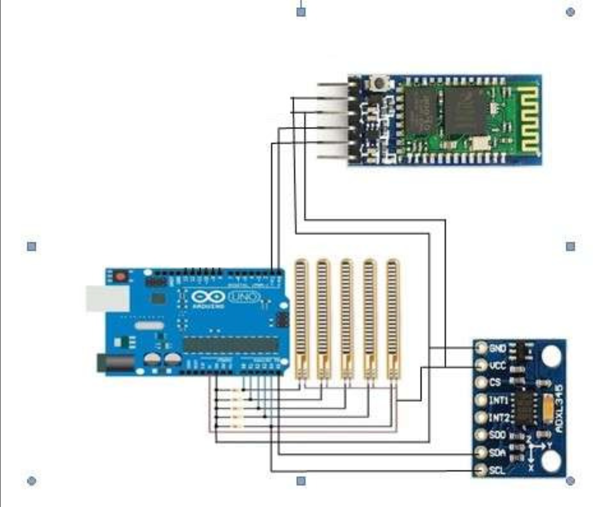
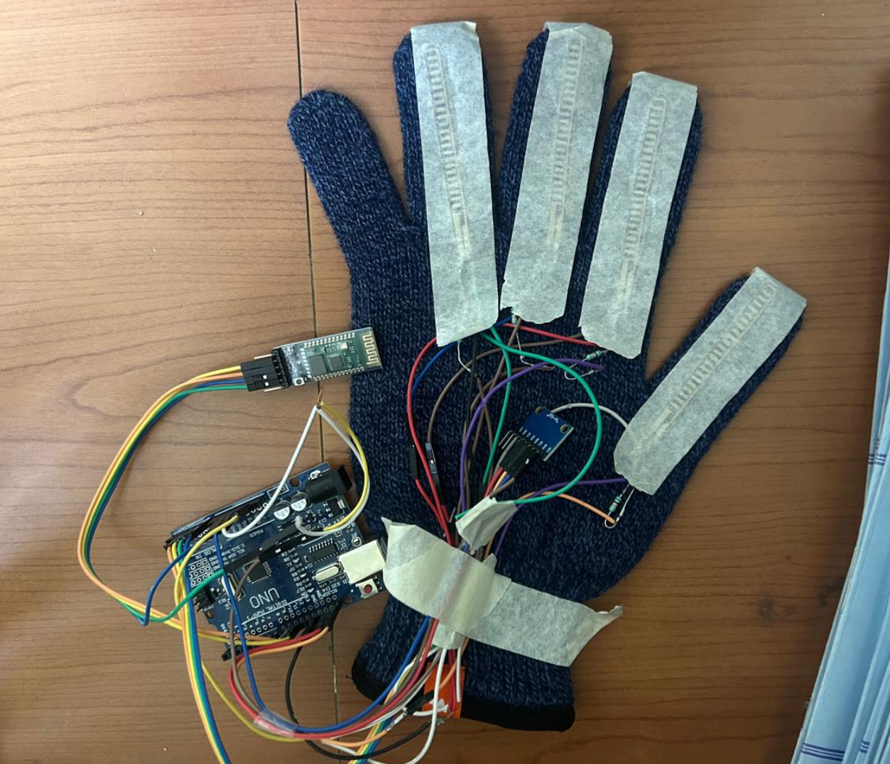

# Smart Glove for Sign Language Recognition

## Overview
This project presents a smart glove system capable of recognizing sign language gestures using four flex sensors and an MPU6050 motion sensor. The glove captures finger bending (via flex sensors) and hand orientation/movement (via the MPU6050), and transmits the data wirelessly using an HC-05 Bluetooth module.

These sensor readings are processed to detect specific hand gestures, which are then converted into corresponding text outputs. The system provides a low-cost, real-time solution to bridge communication gaps between speech-impaired and hearing individuals, emphasizing portability, accuracy, and ease of use.

---

## Images

### Circuit Diagram

### Project Prototype

> Place your images inside an `images/` folder in the repository with the following names:
> - `circuit-diagram.png`
> - `project-photo.png`

---

## Features
- Real-time gesture recognition  
- Wireless communication via Bluetooth  
- Portable and lightweight design  
- Low-cost implementation  
- Modular and expandable system  

---

## Hardware Components
- Microcontroller (e.g., Arduino UNO)  
- 4 Flex Sensors  
- MPU6050 (Accelerometer + Gyroscope)  
- HC-05 Bluetooth Module  
- Power Supply  

---

## System Description
The microcontroller reads the analog values from the flex sensors and digital data from the MPU6050 through I2C communication.

Each gesture is defined by a unique combination of finger bend and hand position, which is matched with predefined patterns in the software. The HC-05 module enables seamless wireless communication with external devices such as smartphones or computers, where the translated text is displayed.

---

## Working Principle
1. Flex sensors detect finger bending  
2. MPU6050 captures hand motion and orientation  
3. Microcontroller processes sensor data  
4. Gesture patterns are matched with predefined mappings  
5. Recognized gestures are converted into text  
6. Text is transmitted via Bluetooth  

---

## Applications
- Assistive communication for speech-impaired individuals  
- Educational and academic projects  
- Human-computer interaction systems  
- Wearable technology research  

---

## Future Scope
This glove can be expanded to include additional sensors for more complex gestures or integrated with voice-based systems for multimodal communication.

Future iterations may involve machine learning algorithms for dynamic gesture training, improving adaptability to different users’ signing styles.

---

## Advantages
- Cost-effective solution  
- Real-time operation  
- Easy to use  
- Portable design  
- Scalable architecture  

---

## Conclusion
The modular and open-source nature of this project makes it suitable for educational purposes, assistive technology development, and hobbyist innovation. It demonstrates an effective approach to translating sign language into text using sensor-based input and wireless communication.

---
